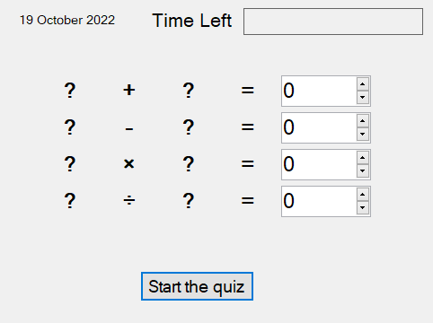
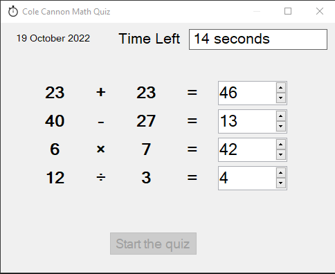
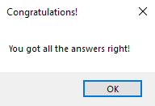
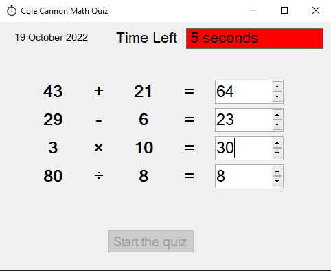
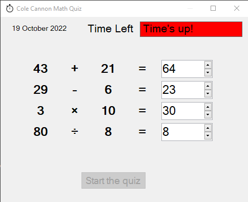
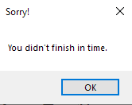

<h1>What is this?</h1>
Timed math quiz game where you must solve an addtion, subtraction, multiplication, and division problem. Problems formatted in variable operator variable format. Also displays the current date. Built in C# & .NET.

